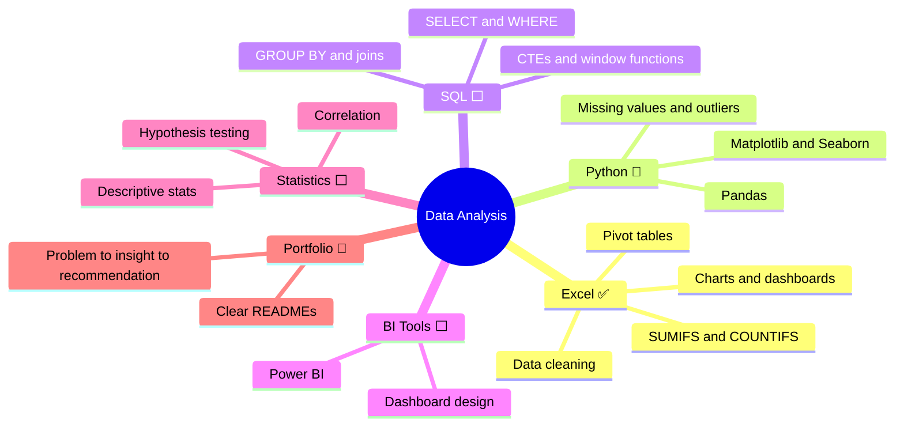

# Data Analyst Portfolio

Business analytics projects by **Pooja Singh**, plus a roadmap for learning data analysis through projects.

📫 [LinkedIn](https://www.linkedin.com/in/pooja-singh-data/) · ✉️ poojas.s199977@gmail.com

---

## 📁 Project Highlights

| Project | Tools | Headline finding | |
|---|---|---|---|
| 🇮🇳 **Amazon India Business Performance** | Excel | Electronics drives **79% of sales** from 30% of orders; **9.85%** of orders are lost to returns and cancellations | [View →](./amazon-indian-business-dashboard-main) |
| 🛒 **Supermart Grocery Sales** | Excel | Sales growth is accelerating (**+28.6%** in 2018) and **discounts show no link to profit** | 🔗 [View ->](https://github.com/PoojaS-1616/data-analyst-portfolio/tree/main/Supermart-Grocery-Sales-Dashboard) |
| 🛍️ **BlinkIT Grocery Sales Analysis** | Python · Pandas · Seaborn | *In progress* | Coming soon |

---

## 🗺️ Data Analysis Learning : A Project-Based Roadmap

✅ done in this repo · 🔄 in progress · ⬜ next

| Topic | Practice project |
|---|---|
| Excel | [Amazon India](./amazon-india-dashboard) · [Supermart](./supermart-grocery-dashboard) |
| Python | BlinkIT Grocery Sales Analysis *(in progress)* |

---

## 🧭 My Approach to Every Project

**Ask** a business question → **Clean** the data → **Explore** patterns → **Explain** in plain language → **Recommend** next steps

---

## 🛠️ Tools Used

Excel · Python (Pandas, NumPy, Matplotlib, Seaborn) · SQL · Git & GitHub
