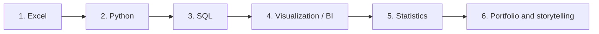

# Data Analyst Portfolio

Business analytics projects by **Pooja Singh**, plus a roadmap for learning data analysis through projects.

📫 [LinkedIn](https://www.linkedin.com/in/pooja-singh-data/) · ✉️ poojas.s199977@gmail.com

---

## 📁 Project Highlights

| Project | Tools | Headline finding | |
|---|---|---|---|
| 🇮🇳 **Amazon India Business Performance** | Excel | Electronics drives **79% of sales** from 30% of orders; **9.85%** of orders are lost to returns and cancellations | [View →](./amazon-india-dashboard) |
| 🛒 **Supermart Grocery Sales** | Excel | Sales growth is accelerating (**+28.6%** in 2018) and **discounts show no link to profit** | [View →](./supermart-grocery-dashboard) |
| 🛍️ **BlinkIT Grocery Sales Analysis** | Python · Pandas · Seaborn | *In progress* | Coming soon |

---

## 🗺️ How to Learn Data Analysis: A Project-Based Roadmap

Each stage builds on the one before it. Click a stage to expand it.

<b>Stage 1: Excel for analysis</b> &nbsp;✅ <i>projects in this repo</i>

 

**Learn:** formulas (`SUMIFS`, `COUNTIFS`, lookups), pivot tables, data cleaning, charts, dropdown filters, KPI cards.

**Practice by building:** a one-page dashboard that answers a business question.

**Example here:** [Amazon India dashboard](./amazon-india-dashboard) · [Supermart dashboard](./supermart-grocery-dashboard)

<b>Stage 2: Python for data analysis</b> &nbsp;🔄 <i>in progress</i>

 

**Learn:** Pandas (loading, filtering, grouping), handling missing values and duplicates, outliers, Matplotlib and Seaborn charts.

**Practice by building:** a full analysis notebook, from raw data to findings.

**Example here:** BlinkIT Grocery Sales Analysis *(coming soon)*

<b>Stage 3: SQL for querying data</b> &nbsp;⬜ <i>next</i>

 

**Learn:** `SELECT`, `WHERE`, `GROUP BY`, joins, subqueries, CTEs, window functions.

**Practice by building:** answer the same business questions from a database instead of a spreadsheet.

<b>Stage 4: Data visualization and BI tools</b> &nbsp;⬜ <i>next</i>

 

**Learn:** dashboard design, choosing the right chart, KPIs, filters, and keeping a dashboard readable for non-technical users.

**Practice by building:** rebuild an existing dashboard in a BI tool such as Power BI.

<b>Stage 5: Statistics</b> &nbsp;⬜ <i>next</i>

 

**Learn:** descriptive statistics, distributions, correlation, hypothesis testing, basic regression.

**Practice by building:** test a claim from an earlier project, for example whether discounts really have no effect on profit.

<b>Stage 6: Portfolio and storytelling</b> &nbsp;🔄 <i>ongoing</i>

 

**Learn:** turning findings into recommendations, writing clear READMEs, presenting to non-technical readers.

**Practice by doing:** for every project, write **Problem → Insight → Recommendation**.

---

## 🧭 A Simple Habit for Every Project

1. **Ask** a clear business question.
2. **Clean** the data and note every assumption.
3. **Explore** patterns with summaries and charts.
4. **Explain** what the numbers mean in plain language.
5. **Recommend** what the business should do next.

---

## 🛠️ Tools Used

Excel · Python (Pandas, NumPy, Matplotlib, Seaborn) · SQL · Git & GitHub
