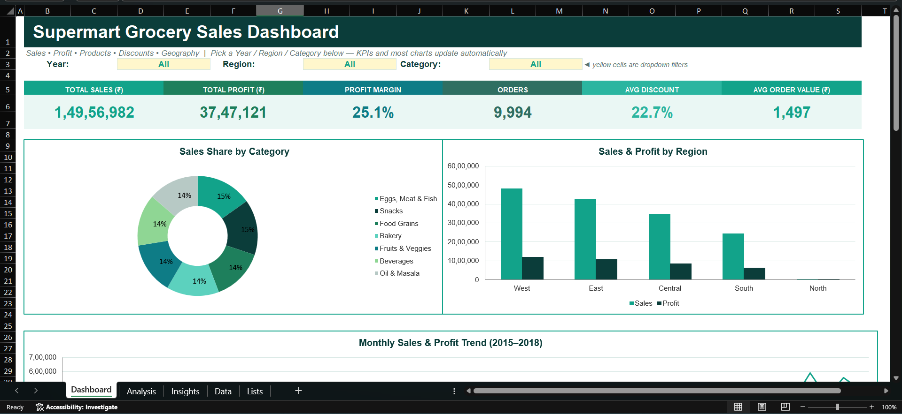

# Supermart Grocery Sales Dashboard

An Excel dashboard that turns 9,994 grocery orders into a single page that a non-technical manager can filter by year, region and category, and read in a couple of minutes.

## Dashboard Preview

## What it answers

**1. How are sales performing overall?**

Total sales, profit, profit margin, orders, average discount and average order value, plus yearly growth, a monthly trend, category share and regional split.

**2. Which products and categories perform best?**

Sales and profit by category and sub-category. I flagged sub-categories with high sales but below-average margin.

**3. Do discounts affect profit?**

Profit and margin by discount band, and the correlation between discount and profit.

**4. Where does the business come from?**

Sales and profit by region and city.

## What the data shows

- The business booked about **₹1.50 crore** in sales and **₹37.5 lakh** in profit, a margin of roughly **25%**.
- Sales grew every year, and growth is speeding up: **+5.3%** in 2016, **+23.6%** in 2017 and **+28.6%** in 2018.
- **September and November** are the strongest months every year. September 2018 was the best month overall (₹5.9 lakh).
- No single category dominates. The seven categories each hold between **13.6% and 15.2%** of sales.
- **West** is the largest region (32% of sales) and **South** the smallest (16%), but South has the best margin (25.6%).
- **Discounts show no link to profit.** The correlation is close to zero (0.008), and margin stays between 24.8% and 25.7% in every discount band.
- A few high-sales items have slightly weaker margins, such as **Spices (23.8%)**, **Masalas (24.2%)** and **Cakes (24.6%)**. Margins are tightly clustered across the range, so these gaps are small.

## What I would recommend

- Plan promotions and stock around the September and November peaks.
- Review pricing on high-sales, low-margin sub-categories such as Spices and Masalas.
- Since discount level makes no visible difference to margin, test whether selective discounts can lift volume without costing profit.

## How it's built

Everything on the dashboard is formula-driven. The `Data` sheet holds the orders, the `Analysis` sheet summarises them with `SUMIFS`, `COUNTIFS` and `AVERAGEIFS`, and the dashboard's KPIs and charts read from those tables.

I added three dropdown filters (Year, Region and Category) so the KPIs and most charts update when the selection changes.

| Sheet | What it does |
|---|---|
| `Dashboard` | The one-page view: filters, KPI cards, charts and key takeaways |
| `Analysis` | Summary tables behind every chart, driven by the dashboard filters |
| `Insights` | My written answers to each project question, plus data notes and assumptions |
| `Data` | The original 9,994 orders |
| `Lists` | Values used by the dropdown filters |

## The dataset

9,994 orders from 2015 to 2018, across 7 categories, 21 sub-categories and 23 cities.

Each row contains the order ID, customer name, category, sub-category, city, order date, region, state, sales, discount and profit. I added Year, Month and Profit Margin columns to support the analysis.

A few things worth knowing:

- Every order is in **Tamil Nadu**, so I did the geographic analysis at city and region level.
- The dataset has **no product or SKU column**, so I used sub-category as the "product" level.
- Order dates came in two formats. I explain how I handled them in [Data_Cleaning_Process.md](Data_Cleaning_Process.md).

## Tools

- Microsoft Excel
- Excel formulas: `SUMIFS`, `COUNTIFS`, `AVERAGEIFS`, `CORREL`
- Dropdown filters (data validation)
- Charts

## Using it

1. Download the `.xlsx` file from this folder.
2. Open it in Excel and go to the `Dashboard` sheet.
3. Use the yellow dropdown cells to filter by Year, Region and Category.

## What I learned

A result of "no relationship" is still a finding. Checking discounts against profit properly, instead of assuming they hurt margin, gave a clearer answer than a guess would have. I also learned that writing down data problems, like the mixed date formats, matters as much as the charts.
