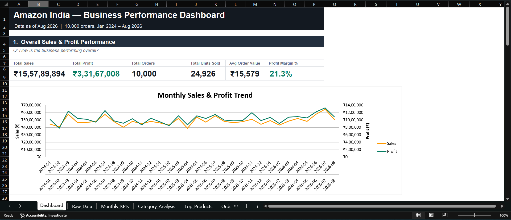

# Amazon India Business Performance Dashboard

An Excel dashboard that turns 10,000 Amazon India orders into a single page.

## Dashboard Preview

## What it answers

**1. How is the business doing overall?**

Total sales, profit, orders, units sold, average order value and profit margin, plus a monthly sales and profit trend from January 2024 to August 2026.

**2. Which categories and products drive the business?**

Sales, profit and units by category, and the top 10 products by sales.

**3. How many orders are completed, and how many are lost?**

Delivered, shipped, returned and cancelled orders, with return and cancellation rates and a category-wise breakdown.

**4. Where does the business come from?**

Sales and profit by payment method and fulfilment method, and sales, profit and orders by state.

## What the data shows

* The business booked about **₹15.58 crore** in sales and **₹3.32 crore** in profit, a margin of roughly **21%**.
* **Electronics & Mobiles** brings in about **79%** of all sales. The other four categories share the rest.
* About **10% of booked sales** (around ₹1.56 crore) was associated with returns and cancellations. Return rate is **4.9%** and cancellation rate is **5.0%**.
* **UPI** is the most used payment method at about **50% of sales**.
* **Amazon-fulfilled (FBA)** orders account for about **69% of sales**.
* **Maharashtra, Karnataka and Delhi** together contribute about **49% of sales**.

## How it's built

Everything on the dashboard is formula-driven. The `Raw_Data` sheet holds the orders, small helper sheets summarise them with `SUMIFS` and `COUNTIFS`, and the dashboard's KPIs and charts read from those helpers.

If the raw data changes, the numbers and charts update on their own.

| Sheet                                                        | What it does                                          |
| ------------------------------------------------------------ | ----------------------------------------------------- |
| `Dashboard`                                                  | The one-page view: KPIs, charts and the four sections |
| `Raw_Data`                                                   | The original 10,000 orders                            |
| `Monthly_KPIs`, `Category_Analysis`, `Top_Products`          | Summary tables behind sections 1 and 2                |
| `Order_Status`, `Category_Returns_Cancellations`             | Summary tables behind section 3                       |
| `Payment_Analysis`, `Fulfillment_Analysis`, `State_Analysis` | Summary tables behind section 4                       |

## The dataset

10,000 orders from January 2024 to August 2026.

Each row contains the order date, category, product, quantity, unit price, discount, total sales, profit, payment method, fulfilment method, order status and shipping state.

One thing worth knowing: returned and cancelled orders still carry a sales value in the data, but their profit is zero. Therefore, **Total Sales** represents the sales value recorded in the dataset, while the return and cancellation analysis shows the orders associated with those statuses.

## Tools

* Microsoft Excel
* Excel formulas
* `SUMIFS`
* `COUNTIFS`
* Helper tables
* Charts

## Using it

1. Download the `.xlsx` file from this repository.
2. Open it in Excel and go to the `Dashboard` sheet.
3. To use your own data, paste it into `Raw_Data` using the same columns.
4. Refresh or recalculate the workbook if required.

## What I learned

Designing for a non-technical reader changes the work. Choosing which numbers to leave out mattered as much as choosing which to show, and writing the business question above each section kept every chart tied to a business question.

